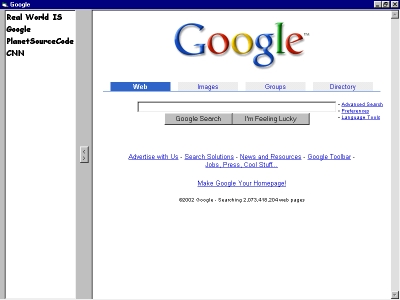



## Classroom Browser

### Description

The Classroom, or 'Restricted' browser is a highly-simplified web browser originally built and donated to a small school. The user of the application sees a list of 'accessible' sites. These are the only sites that can be accessed through the web browser. Links from an accessible site to an 'inaccessible' site are trapped and blocked.
 
### More Info
 
A file called 'sitelist.xml' that sits in the same folder as the application. This is the data file the application uses to determine what sites can be accessed.

             |
---                |---
**Submitted On**   |2002-07-29 22:13:30
**By**             |[Chris Anderson \- Real World IS](https://github.com/Planet-Source-Code/PSCIndex/blob/master/ByAuthor/chris-anderson-real-world-is.md)
**Level**          |Intermediate
**User Rating**    |4.7 (14 globes from 3 users)
**Compatibility**  |VB 6\.0
**Category**       |[Internet/ HTML](https://github.com/Planet-Source-Code/PSCIndex/blob/master/ByCategory/internet-html__1-34.md)
**World**          |[Visual Basic](https://github.com/Planet-Source-Code/PSCIndex/blob/master/ByWorld/visual-basic.md)
**Archive File**   |[Classroom\_11235273020\.zip](https://github.com/Planet-Source-Code/chris-anderson-real-world-is-classroom-browser__1-37383/archive/master.zip)

### API Declarations

The current code references the Microsoft XML parser v3.0. This was done to support the future possiblity of having the accessible site list hosted online, rather than deployed with the application.

